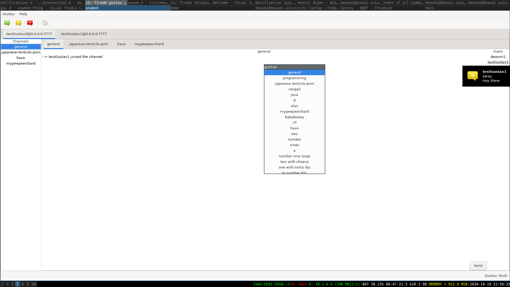

# Gustav

**Gustav** is a GTK graphical DNET client written in D.

Initial prototype client with some features added such as message log, channels and user list

Showing more messages coming through

Now a message box has been added whereby you can send messages, this is also where only messages destined to a channel now come through

Status popups (not seen), added toolbar

Chats implemented

Chats implemented

Chats implemented, tooltips with status messages, status message box, new channel selector, channels on sidebar are now only the ons you have joined
